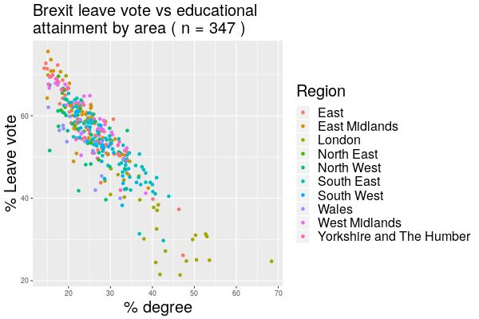

# Linear modelling and correlation

In this final week we will be learning about linear modelling via regression and correlation. The aims are to understand the linear regression model and identify the response and regressor variables, use the model for prediction and the potential limitations of the model. Further we will analyse residuals and identify problems with the model from this viewpoint. 

Next we will understand the concept of a correlation coefficient and some potential pitfalls in their use and interpretation.


## Linear regression

Regression is concerned with modelling the relationship between two (or more) variables. We have concentrated principally on developing methods for a single random variable, but many data sets provide information about several variables and we want to study connections between these variables. We will concentrate on quantitative variables $x$ and $y$ where these are observed in pairs $(x,y)$.

The data may be collected at the same time. Some examples:

| $x$| $y$ |
|:-:|:-:|
| Speed of ski jumper | Distance jumped |
| Hand span | Foot length |
| No. red blood cells | No. white blood cells |
| Size of house | Value of house |


However the data may be collected at a later time though the link is clear. We will not study the temporal aspect here. 

| $x$| $y$ |
|:-:|:-:|
| Mark in a mock exam | Mark in real exam |
| Amount of fertiliser | Amount of growth |
| Height of father | Height of adult son |

In some cases the variable $x$ affects the variable $y$. In other cases both may be affected by some third unmeasured factor.

:::{.definition}
The variable $x$ is called the *explanatory* or *independent* variable. The variable $y$ is called the *response* or *dependent* variable.
:::


:::{.example}
The petrol consumption of a car is related to the speed at which it is driven. 

| mph | 35 | 35 | 35 | 35 | 40 | 40 | 40 | 40 | 
|:-:|:-:|:-:|:-:|:-:|:-:|:-:|:-:|:-:|
| mpg | 48.4 | 47.6 | 47.8 | 46.2 | 45.8 | 45.6 | 45.0 | 44.9 |

| mph | 45 | 45 | 45 | 45 | 50 | 50 | 50 | 50 | 
|:-:|:-:|:-:|:-:|:-:|:-:|:-:|:-:|:-:|
| mpg | 43.0 | 42.8 | 42.7 | 42.2 | 39.9 | 40.3 | 38.9 | 39.6 |

Suggest the likely average fuel consumption of a car travelling at 42 mph.
:::

 Here is a similar example with the fuel consumption and weight of car.


```{r fuel1, echo=FALSE, warning=FALSE}
library(ggplot2)
# Basic scatter plot
ggplot(mtcars, aes(x=wt, y=mpg)) + geom_point()+labs(title="Relationship between fuel consumption and weight of car", x = "Weight (1000 lbs)", y = "Miles per gallon")
```


Here is another example from a political context.

```{r brexit, fig.align="center",out.width = "75%", fig.cap="Regions with a lower percentage of graduates had a higher proportion of those voting leave", echo=FALSE}

```


The simplest relationship to consider between $y$ and $x$ is the straight line $y=a+bx$. When points are plotted we are often in a situation where the points do not lie exactly on any straight line.

```{r fuel2, echo=FALSE, warning=FALSE}
library(ggplot2)
# Basic scatter plot
ggplot(mtcars, aes(x=wt, y=mpg)) + geom_point()+labs(title="Relationship between fuel consumption and weight of car", x = "Weight (1000 lbs)", y = "Miles per gallon") +
  geom_smooth(method='lm', formula= y~x,se=FALSE)
```


One needs to account for some error in the observation.

:::{.definition}
The *simple linear regression model* is the equation
$$Y=a+bX+\varepsilon$$

where $\varepsilon$ is a normally distributed random variable with mean zero and some constant variance. That is,

$$\varepsilon \sim \text{N}(0,\sigma^2)$$
For any particular value $X=x_i$ and $Y = y_i$, we would predict $a+bx_i$. Sometimes the model is summarised as $\text{E}(Y)=a+bX$.

The *regression line* is the line 
$$y = a +bx$$
:::


To fit the model $y=a+bx$ the points could be plotted and $a$ and $b$ estimated by eye. However this is a subjective process. For two independent variables it becomes difficult to fit by eye, and in higher dimensions this is impossible to do. We consider what constrains line.

:::{.definition}
Given an observed datum $(x_i,y_i)$ and a fitted regression line $y=a+bx$, the ***residual*** $r_i$ is the difference between the observed value and the value predicted by the regression line. That is,

$$r_i = y_i - (a+bx_i)$$
:::

Small residuals are desirable. However, residuals can be positive or negative, depending on whether the point lies vertically above or below the regression line. Taken together, we see that minimising the sum of squared residuals will achieve the optimal linear model. That is, if we let 
$$S = \sum_{i=1}^{n}r_i^2$$
Then _the_ regression line $y=a+bx$ minimises $S$.

```{r resids1,message=FALSE, echo=FALSE, fig.cap="Red residuals are positive, and blue residuals are negative"}
d <- mtcars
fit <- lm(mpg ~ wt, data = d)

d$predicted <- predict(fit)   # Save the predicted values
d$residuals <- residuals(fit) # Save the residual values

ggplot(d, aes(x=wt, y=mpg)) +
  labs(title="Residuals of fuel consumption and weight of car", x = "Weight (1000 lbs)", 
        y = "Miles per gallon") +
  geom_smooth(method = "lm", se = FALSE, color = "lightgrey") +
  geom_segment(aes(xend = wt, yend = predicted,color=sign(residuals))) +

  # > Color adjustments made here...
  geom_point(aes(color = sign(residuals))) +  # Color mapped here
  scale_color_gradient2(low = "blue", high = "red") +  # Colors to use here
  guides(color = FALSE) +
  # <

  geom_point(aes(y = predicted,color = sign(residuals)),shape=1)
  

```


:::{.theorem}
Given $n$ points $(x_i,y_i)$, $1\leq i\leq n$, and regression line $y=a+bx$ then we have that

$$a = \bar{y}-b\bar{x},$$
$$b = \frac{s_{xy}}{s_{xx}},$$
where 
$$s_{xx} = \sum x_i^2 - \frac{(\sum x_i )^2}{n}$$
and
$$s_{xy} = \sum x_iy_i - \frac{(\sum x_i )(\sum y_i )}{n} $$
:::

_proof_

Consider the sum of the squared residuals

$$S = \sum_{i=1}^{n} r_i^2$$

Then $S=S(a,b)$ is a function of $a$ and $b$.

$$S(a,b)=\sum_{i=1}^{n} (y_i - (a+bx_i))^2$$
Expanding gives 

$$S(a,b) = \sum y_i^2 - 2a\sum y_i - 2b\sum x_i y_i + a^2n + 2ab\sum x_i + b^2 \sum x_i^2$$

Now we can find the minumum of this function (which is a minimum because it is a sum of squares) by partially differentiating and setting this equal to zero.

$$\frac{\partial S(a,b)}{\partial a} =-2\sum y_i+ 2an +2b\sum x_i$$
Setting $\frac{\partial S(a,b)}{\partial a}=0$ implies,

$$0=-\sum y_i+ an +b\sum x_i $$

$$a= \frac{1}{n}\left(\sum y_i - b \sum x_i\right).$$
Likewise partially differentiating with respect to $b$ gives:
$$ \frac{\partial S(a,b)}{\partial b} = -2\sum x_i y_i+2a\sum x_i + 2b\sum x_i^2$$
Again setting this equal to zero gives:

$$= -\sum x_i y_i+a\sum x_i + b\sum x_i^2 ,$$
which implies

$$b = \frac{\sum x_iy_i - a\sum x_i}{\sum x_i^2}.$$
Substituting in the result for $a$ gives the result.

:::{.example}
Fit a linear regression line to the following data

| $x$ | 2 | 3 | 5 | 7 |
|:-:|:-:|:-:|:-:|:-:|
| $y$ | 4 | 7 | 9 | 12 |

_solution_

| $y$ | $x$ | $xy$ | $x^2$|
|:-:|:-:|:-:|:-:|
| 4 | 2 | 8 | 4 |
| 7 | 3 | 21 | 9 |
| 9 | 5 | 45 | 25 |
| 12 | 7 | 84 | 49 |
| $\sum y =32$ | $\sum x = 17$ | $\sum xy = 158$ | $\sum x^2 = 87$ |

Then

$$b = \frac{\sum xy - \frac{\sum x \sum y}{n}}{\sum x^2 - \frac{(\sum x)^2}{n}} $$
$$=\frac{158 - \frac{17\times32}{4}}{87 - \frac{17^2}{4}} =1.4915$$

and 

$$a = \frac{1}{n}(\sum y -b \sum x) =\frac{1}{4}(32 - 1.4915\times 17) = 1.661$$
So the line is 

$$y = 1.66 + 1.49x$$
:::

:::{.example}
For the car data in example $10.1$. We have that $n=16$ and the following:
$$\sum x_i = 680 \ , \ \sum x_i^2 = 29400$$
$$\sum y_i = 700.7 \ , \ \sum y_i^2 = 30828.05$$
Calculate the least squares estimates of $a$ and $b$.

_answer_

$$s_{xy} = 29518.5 - \left(\frac{680\times700.7}{16}\right) = -261.25$$
$$s_{xx} = 29400 - \left(\frac{680^2}{16}\right) = 500.00$$
$$b = \frac{s_{xy}}{s_{xx}} = \frac{-261.25}{500.00}= -0.5225$$
$$a= \bar{y}-b\bar{x}=\frac{1}{16}[700.7 - (0.5225\times680)]= 66.0$$
Hence the line is 
$$y = 66.0 -0.5225x$$
And the predicted value at $42$mph is therefore
$$y = 66.0 -0.5225\times 42 = 44.055\approx 44$$

:::

A linear model can be fitted in R with the command $\texttt{lm(formula = y}\sim\texttt{x)}$.


## Residual analysis

The residuals are realisations of the modelled error term $\varepsilon \sim \text{N}(0,\sigma^2)$. If the model is appropriate then we would expect the residuals to look approximately as if from this normal distribution. That is, they should be small in magnitude and random. This can be investigated graphically.

:::{.example}
The residuals in the earlier example can be plotted in a histogram, and we can plot a quantile-quantile plot, and series plots.

```{r residplots, echo=FALSE,message=FALSE, warning=FALSE, fig.cap="Residuals plots for the fuel consumption vs weight of car data"}
library(tidyverse)
par(mfrow=c(2,2))

d$residuals %>% hist(main="Histogram")

d$residuals %>% qqnorm()

d$residuals %>% plot(type="b",main="Residuals in time order")

plot(x= d$predicted, y= d$residuals, xlab="predicted",ylab="residuals",main="Residuals v Fitted")


```
:::

In general, the following may be noted about these plots.

- The quantile-quantile plot matches the observed sample quantile with the quantiles of the theoretical normal distribution, and so for a good fit one would expect a straight line with gradient $1$. 

- Residuals series, there should be no consistent pattern over time (i.e. regular increase or decrease) and there should be no outliers.

- The histogram should look unimodal and symmetrical. 

- residual and fitted value scatter plot should have no evident patterns. 

Let's see an example where this does not work.

:::{.example}
In an experiment into using a biological enzyme in washing powder the enzyme activity $y$ was measured at different washing temperatures $x$.

| x | 20 | 30 | 40 | 50 | 60 | 70 | 80 | 90 |
|:-:|:-:|:-:|:-:|:-:|:-:|:-:|:-:|:-:|:-:|:-:|
| y | 162 | 207 | 234 | 240 | | | | |

```{r enzyme1, echo=FALSE,message=FALSE, warning=FALSE,results="hide"}
set.seed(123)
x<- seq(20,90,10)

y <- 0.003*x*(0.4*x-60)^2 + rnorm(8)

plot(x=x[1:4],y=y[1:4], main = "Initial data and fitted line") +
  abline(lm(y[1:4] ~ x[1:4]))
```

Further data is collected: 

| x | 20 | 30 | 40 | 50 | 60 | 70 | 80 | 90 |
|:-:|:-:|:-:|:-:|:-:|:-:|:-:|:-:|:-:|:-:|:-:|
| y | 162 | 207 | 234 | 240 | 233 | 217 | 189 | 154 |

```{r enzyme2,  echo=FALSE, message=FALSE, warning=FALSE,results= 'hide'}
fit2 <- lm(y[1:4]~x[1:4])

p <- plot(x=x,y=y, main = "Further data and initially fitted line") +
  abline(lm(y[1:4] ~ x[1:4]))
```

Should a new line be fitted to the data?
:::

If we look at the residuals from the original line over time we see that they are increasingly negative. This suggests that a linear is not suitable as a model, and a non-linear model such as a quadratic is more suitable. In context this may be because at higher temperatures the enzyme is denatured so is increasingly less effective.

```{r enzyme, echo=FALSE}

resids<- y-(fit2$coefficients[1] +fit2$coefficients[2]*x)

resids %>% plot(main = "Residuals from original line")
```


## Analysis of Variance

The aim of fitting a regression model is to try and explain the variation in the response $Y$ assuming it was generated by a linear model with random error. 

$$y= a+bx+\varepsilon$$

Anything left over is random variation. A useful model will explain a significant proportion of this random variation. Thus,

$$\text{Variation in data} = \text{ variation in model} \  + \ \text{unexplained variation}$$
In linear models this variation is measured by sums of squares (SS) as follows:

$$SS_{T} =  SS_R + SS_E$$
So the total sum of squares equals the sum of squares due to regression add the error sum of squares. 

The analysis is usually set out in an ANOVA table which can be used to test for the significance of the slope parameter.

$$H_0 : b=0$$
:::{.definition}
- The ***total sum of squares*** is given by 

$$SS_T = \sum (y-\bar{y})^2= \sum y^2 - \frac{(\sum y)^2}{n}$$
- The ***regression sum of squares*** is given by

$$SS_R = b^2\sum(x-\bar{x})^2 = b^2 \left\{ \sum x^2 - \frac{(\sum x)^2}{n}\right\}$$
- The ***error sum of squares*** is given by 
$$SS_E=SS_T-SS_R $$
:::

:::{.definition}
The regression Analysis of Variance table is written as 

| Source | Degrees of Freedom | SS | MS |
|:-:|:-:|:-:|:-:|
| Regression | 1 | $SS_R$ | $SS_R / 1 $ |
| Error | $n-2$ | $SS_E$ | $SS_E / (n-2)$ |
| Total | $n-1$ | $SS_T$ | | 

This is given in the formula book. To test $H_0 : b = 0$, one compares the ratio of the Mean sum of squares (MS) to the F-distribution critical value. That is,

$$F=\frac{MS_R}{MS_E}\sim F_{1,n-2} $$
:::

:::{.example}
Sales of major appliances vary with the new housing market. When new home sales are high, so too are the sales of appliances such as dishwashers, washing machines, and so on. 

| Housing starts (thousands) | Appliance sales (thousands) | 
|:-:|:-:|
| 2.0 | 5.0 | 
| 2.5 | 5.5 | 
| 3.2| 6.0 |
| 3.6 | 7.0 |
| 3.3 | 7.2 | 
|4.0 | 7.7 |

Suppose we have calculated the regression line $y=2.1549 + 1.3694x$ and the summary statistics: 

$$\sum x = 18.6 \ , \ \sum x^2 = 60.34$$
$$\sum y = 38.4 \ , \ \sum y^2 = 251.38$$
Calculate the ANOVA table and test the hypothesis that $H_0 : b = 0$.
:::

_solution_

We will only round at the end as we need to maintain accuracy to compare to a critical value.
$$SS_T = 251.38 - \frac{38.4^2}{6} = 5.62$$
$$SS_R = (1.3694)^2 \left( 60.34 - \frac{18.6^2}{6} \right) = 5.025\ldots$$
$$SS_E = SS_T - SS_R = 5.62 - 5.025\ldots = 0.5943\ldots $$

$$MS_R = 5.02\ldots /1 = 5.025 $$
$$MS_E = 0.5843\ldots / 4 = 0.1485\ldots$$

We can complete the ANOVA table as follows

| Source | Degrees of Freedom | SS | MS |
|:-:|:-:|:-:|:-:|
| Regression | 1 | $5.025687$ | $5.025687$ |
| Error | $4$ | $0.5943129$ | $0.1485782$ |
| Total | $5$ | $5.62$ | | 

We have that 

$$F = \frac{5.025687}{0.1485782}=33.825188$$

From tables one can find the $95^{\text{th}}$ percentile as $F_{1,4}=7.71$

Since $33.83 > 7.71$ we can reject $H_0$.

We can evaluate these tables manually, and may be required to do so in an exam, but they can be obtained from statistical software too, such as R. In R an ANOVA table can be obtained from the combination of the commands $\texttt{aov()}$ and $\texttt{summary()}$.

:::{.example}
In the housing example above we can do this analysis in R as follows:

```{r housing}
x <- c(2.0,2.5,3.2,3.6,3.3,4.0)
y <- c(5.0,5.5,6.0,7.0,7.2,7.7)
df <- as.data.frame(cbind(x,y))

aov(y~x,df) %>% summary()


```

:::


## Confidence and prediction intervals

In this section we will calculate two kinds of intervals to do with regression which give a range of plausible values for the response $y$. The first is a confidence interval for the mean response $\bar{Y}$. The second accounts for further variability in $Y$ and is called a prediction interval.


:::{.definition}
A $100(1-\alpha)\%$ confidence interval for the mean response at a particular regression point $x_0$ is given by

$$a+bx_0 \pm t_{n-2}\hat{\sigma}\sqrt{\frac{1}{n}+ \frac{(x_0-\bar{x})^2}{\sum(x-\bar{x})^2}}$$
where $\hat{\sigma}=\sqrt{MS_E}$ from the ANOVA table.
:::

:::{.example}
Calculate $95\%$ confidence interval for the mean response at $x_0 = 3.9$ for the housing example above.

_solution_

$$t_{4,0.0025}=2.7764$$
$$\bar{x} = 18.6/6$$
$$a+bx_0 = 2.1549 + 1.3694 \times 3.9 = 7.49556$$
The interval is then given by

$$7.49556 \pm 2.7764\times0.3854584\sqrt{\frac{1}{6}+\frac{(3.9 - 3.1)^2}{2.68}}$$
That is $$(6.81,8.18)$$ (3 s.f.).
:::

:::{.definition}
A $100(1-\alpha)\%$ prediction interval for the response $y_0$ at a particular regression point $x_0$ is given by

$$a+bx_0 \pm t_{n-2}\hat{\sigma}\sqrt{1+\frac{1}{n}+ \frac{(x_0-\bar{x})^2}{\sum(x-\bar{x})^2}}$$
:::

Note that this is the same formula except that there is an extra $1$ in the square root.

:::{.example}
A $95\%$ prediction interval for the appliance sales when housing starts equals $3900$ is given by

$$7.49556 \pm 2.7764\times0.3854584\sqrt{1+\frac{1}{6}+\frac{(3.9 - 3.1)^2}{2.68}}$$
$$=7.49556\pm 1.2687344$$
which gives $(6.23,8.76)$ (3 d.p.).
:::

Prediction intervals and confidence intervals can be calculated for any point $x_0$. 

```{r predex, echo=FALSE,message=FALSE, warning=FALSE, fig.cap="Confidence intervals appear in grey, and prediction intervals appear in pink."}
#define dataset
data <- mtcars[ , c("mpg", "wt")]

#create simple linear regression model
model <- lm(mpg ~ wt, data = mtcars)

#use model to create prediction intervals
predictions <- predict(model, interval = "predict")

#create dataset that contains original data along with prediction intervals
all_data <- cbind(data, predictions)

#load ggplot2 library
library(ggplot2)

#create plot
ggplot(all_data, aes(x = wt, y = mpg)) + #define x and y axis variables
  geom_point() + #add scatterplot points
  stat_smooth(method = lm) + #confidence bands
  geom_line(aes(y = lwr), col = "coral2", linetype = "dashed") + #lwr pred interval
  geom_line(aes(y = upr), col = "coral2", linetype = "dashed") + #upr pred 
  labs(title="Fuel consumption and weight of car", x = "Weight (1000 lbs)", y = "Miles per gallon")

```


Notice that prediction intervals are generally wider than confidence intervals. We will not derive these formulas, though you are expected to know how to use them, and they appear in the formula book.

Note also that the width of the intervals increases near the ends of the available data, suggesting that there is more uncertainty at the extremes. Notice that the fuel consumption could never go below zero, so extrapolation for this data based on this model would be unreliable for weights above say $6000$ lbs.

## PMCC

A correlation coefficient is a measure of the strength of the (linear) relationship between two variables.We denote the population correlation coefficient by the Greek letter r - $\rho$, and the sample correlation coefficient by $r$.

The Pearson product moment correlation coefficient (PMCC) is closely related to the gradient of a simple linear regression line.

:::{.definition}
 Given $n$ observations $(x_i,y_i)$ where $1\leq i \leq n$, the ****Pearson product moment correlation coefficient (PMCC)**** is given by
 
$$r = \frac{s_{xy}}{\sqrt{s_{xx}s_{yy}}}$$
$$=\frac{\sum xy - n\bar{x}\bar{y}}{\sqrt{(\sum x^2 - n\bar{x}^2)(\sum y^2 - n\bar{y}^2)}} $$
:::

The sign of the correlation is determined by the numerator in this expression. The denominator ensures that the coefficient always lies between the extremes of $-1$ and $1$. If the observations lie on a _straight line_ then the PMCC equals $\pm 1$. With real data, it is extremely unlikely due to experimental error.

:::{.example}
The following data shows the age $x$ (in years) and the second-hand price $y$ (in hundreds of pounds) of a sample of $11$ cars advertised online.

| x | 5 | 7 | 6 | 6 | 5 | 4 | 7 | 6 | 5 | 5 | 2 |
|:-:|:-:|:-:|:-:|:-:|:-:|:-:|:-:|:-:|:-:|:-:|:-:|
| y | 80 | 57 | 58 | 55 | 70 | 88 | 43 | 60 | 69 | 63 | 118 |

Calculate the PMCC for this data and interpret this in context.

_solution_ 

One can use the formula or another calculation method, and find that $r = -0.957$. This indicates a strong negative correlation between the age and the value of a car. In context this means that cars that are less old are worth more than older cars which are worth less (but not worthless).
:::


### Pitfalls

- Correlation does not imply causation. Even if a causal relationship exists, it may be reverse or due to a third unrelated or unmeasured factor. Ice cream sales and deaths in open water are correlated - why? Tree movement rate and wind speed are causally related, but which is the response? More seriously, this issue appears very often in the media when (mis)reporting findings of medical studies.

- Correlation measures linear relationships. Variables may be perfectly related in a non-linear fashion e.g. an exponential decay or quadratic curve, but could have zero linear correlation coefficient.

- Correlations may be hidden or exaggerated due to clusters in the data which behave in distinctive ways. A plot of beak length of birds may have different trends for different species. 

- The correlation coefficient is not equal to the gradient of the regression line.


## Hypothesis tests for correlation

It is easy to say if a correlation coefficient is close to $1$ or $-1$ that there is a strong correlation - but what if $r=0.6$? At what point do we say that there is no correlation, based on this number alone?

The answer is that we can conduct a hypothesis test, using $r$ as a statistic. We can test the hypotheses:

$$\text{H}_0 : \rho = 0, \ \  \ \  \text{H}_1: \rho \neq 0$$
If the sample correlation coefficient $r$, in absolute value, exceeds a critical value from tables, then we may reject the null hypothesis. 

:::{.example}
The following data refer to the average temperature (in degrees Farenheit) and the average butterfat content for a herd of cows (expressed as a percentage of the milk).

| Temp. | 64 | 65| 65 |64|61 |55| 39 |41 |46 |59|
|:-:|:-:|:-:|:-:|:-:|:-:|:-:|:-:|:-:|:-:|:-:|
| Butterfat | 4.65 | 4.58 | 4.67 | 4.6 | 4.83 | 4.55 | 5.14 | 4.71 | 4.69 | 4.65 |

| Temp. | 56 | 56| 62 |37|37 |45| 57 |58 |60 |55|
|:-:|:-:|:-:|:-:|:-:|:-:|:-:|:-:|:-:|:-:|:-:|
| Butterfat | 4.36 | 4.82 | 4.65 | 4.66 | 4.95 | 4.6 | 4.68 | 4.65 | 4.6 | 4.46 |

Test at the $5\%$ significance level whether there is evidence of any correlation between the two variables.

_solution_ 

One calculates $r=-0.453$. 

The degrees of freedom equal $n-2 = 18$.

Comparing this to the tables with level $5\% /2 = 0.025$ gives $0.444$.

Therefore as $|r| = 0.453 > 0.444$ we can reject $H_0$ and conclude that there is a weakly negative correlation.
:::

Notes.

- Hypothesis testing with the PMCC assumes that the data are a random sample from normal marginals in $x$ and $y$. If the data is not a random sample from a normal population, then this analysis is not appropriate.

- In some circumstances wemay wish to test against a one-sided alternative. That is that the correlation is strictly positive or negative. In this situation one should look up the $5\%$ value rather than the $2.5\%$ value. 

## Summary

- A linear model is an equation

$$y = a+bx +\varepsilon$$

- There are formulas for $a$ and $b$:
$$a = \bar{y}-b\bar{x},$$

$$b = \frac{s_{xy}}{s_{xx}}$$
- Residuals are the difference between the point and the regression line. There are a few useful graphs that can tell if the model is a good fit to the linear model.

- A test for significance for the coefficient $b$ is done via an ANOVA F-test. The table appears in the formula booklet.

- Confidence and prediction intervals can be calculated to quantify uncertainty about the predicted value of the response.


- Sample correlation can be calculated via 
$$r = \frac{s_{xy}}{\sqrt{s_{xx}s_{yy}}}$$

- There is a hypothesis test to detect if there is a correlation or not. 


## Exercises week 10

:::{.exercise}
Eight pairs of observations on the variables $x$ and $y$ are given below.

| x | 1.2 | 0.5 | 0.8 | 0.1 | 2.3 | 1.1 | 1.8 | 2.2 |
|:-:|:-:|:-:|:-:|:-:|:-:|:-:|:-:|:-:|
| y | 8.1 | 4.3 | 7.1 | 3.5 | 12.8 | 8.4 | 9.9 | 11.4 |

a) Calculate $\sum x$, $\sum x^2$, $\sum y$, $\sum y^2$, $\sum xy$.

b) Find $\bar{x}$, $\bar{y}$, $s_{xx}$, $s_{yy}$ and $s_{xy}$

c) Find the values of $a$ and $b$ for the regression line $y=a+bx$.
:::


:::{.exercise}
Six pairs of observations on the variables $x$ and $y$ are given below.

| x | 55.7 | 10.4 | 67.1 | 91.2 | 30.8 | 72.1 | 
|:-:|:-:|:-:|:-:|:-:|:-:|:-:|
| y | 21.2 | 45.9 | 88.3 | 11.4 | 75.4 | 21.4 | 

a) Calculate $\sum x$, $\sum x^2$, $\sum y$, $\sum y^2$, $\sum xy$.

b) Find $\bar{x}$, $\bar{y}$.

c) Find the values of $a$ and $b$ for the regression line $y=a+bx$.
:::


:::{.exercise}
Five pairs of observations on the variables $x$ and $y$ are given below.

| y | 357.2 | 284.3 | 435.8 | 571.9 | 101.2 |
|:-:|:-:|:-:|:-:|:-:|:-:|
| x | 0.0149 | 0.0375 | -0.0172 | -0.0345 | 0.0651 | 

a) Calculate $\sum x$, $\sum x^2$, $\sum y$, $\sum y^2$, $\sum xy$.

b) Find $\bar{x}$, $\bar{y}$.

c) Find the values of $a$ and $b$ for the regression line $y=a+bx$.

d) Estimate the value of $y$ when $x=0.0572$.
:::


:::{.exercise}
When a car isdriven under specified conditionsofload, tyre pressure and surrounding temperature, the temperature $T^{o}C$, generated in the shoulder of the tyre varieswith the speed $V \ \text{km}/\text{h}$, according to a linear model $T=a+bV$. Measurements of $T$ were made at eight different values of $V$ with the following results.

| v | 20 | 30 | 40 | 50 | 60 | 70| 80 | 90 |
|:-:|:-:|:-:|:-:|:-:|:-:|:-:|:-:|:-:|
| t | 45 | 52 | 64 | 66 | 91 | 86 | 98 | 104 |

Given the following 

$$\sum v = 440, \ \sum v^2 = 28400, \ \sum t =606, \ \sum t^2 = 49278, \ \sum vt = 37000 $$

a) Calculate the estimated regression line of $T$ on $V$. 

b) Estimate the value of $T$ when $V=60$.

c) Calculate the ANOVA table for the data. 

d) Test the hypothesis $\text{H}_0: b=0$.
:::


:::{.exercise}
An anemometer is used to estimate wind speed by observing the rotational speed of its vanes. This speed is converted to wind speed by means of an equation obtained from calibrating the instrument in a wind tunnel. In this calibration the wind speed is fixed precisely and the resulting anemometer seed is noted. For a particular anemometer this process produced the following set of data.

| Actual speed (m/s) | Anemometer revs (rev/min) |
|:-:|:-:|
|1.0| 30|
|1.1| 38|
|1.2| 48|
|1.3 |58|
|1.4| 68|
|1.5| 80|
|1.6 |92|
|1.7 |106|
|1.8| 120|
|1.9 |134|

a) Obtain the least squares regression line for these data

b) Calculate an ANOVA table for these data

c) Test the hypothesis $\text{H}_0: b=0$.

d) Calculate a $95\%$ prediction interval for when the actual wind speed is $1.65 m/s$

e) Give an example using a relevant calculation with the regression line, that it is unwise to extrapolate outside the range of this data.
:::

:::{.exercise}
A hospital doctor was interested in the percentage of a certain drug absorbed by patients. She obtained the following data on $10$ patients taking the drug on two separate days.

| Patient | Day 1, x | Day 2, y |
|:-:|:-:|:-:|
|1 | 35.5 | 27.6|
|2 | 16.6 | 15.1|
|3 | 13.6 | 12.9|
|4 | 42.5 | 34.1|
|5 | 28.5 | 35.5|
|6 | 30.3 | 32.5|
|7 | 8.7  | 84.3|
|8 | 21.5 | 21.5|
|9 | 16.4 | 11.1|
|10| 32.3 | 36.4 |

a) Calculate the product moment correlation coefficient $r$ for this data.

b) Test at the $5\%$ significance level whether or not there is no correlation. That is $H_0:\rho = 0$.

c) After examining a plot of the data, the doctor found one of the points was surprising. This result was an anomaly and excluded from the analysis. The $r$ value for the remaining $9$ points is $0.863$. Which point was omitted?

:::

