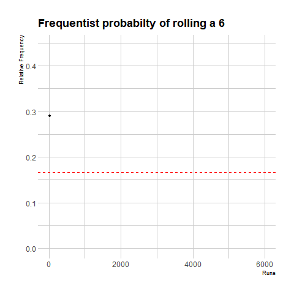

```{r setup, include=FALSE}
knitr::opts_chunk$set(echo = TRUE)
```

```{r include=FALSE}
# automatically create a bib database for R packages
knitr::write_bib(c(
  .packages(), 'bookdown', 'knitr', 'rmarkdown'
), 'packages.bib')
```

# Introduction to Probability {#intro}

Some things that happen are entirely predictable. For example, if one drops a ball from a height, we know it will hit the ground. Things that happen like this can be decribed as _deterministic_. You may have heard people talk about things being written in the stars, or their fate, or destiny. The opinion that all things are pre-determined is called _determinism_. 

However, even if are a determinist, you will have to live with uncertainty. In our everyday lives we can think of examples where things happen that we cannot predict; a bus may be late, it may rain, or one might win the lottery. To one living with uncertainty, it is reasonable to quantify this uncertainty and act assuming outcomes are not pre-determined. If the outcome is not pre-determined then it is called ***random***.

The Mathematics of random phenomena is called Probability Theory. Most people have an intuitive idea of what is meant by probability or chance.  Unfortunately Probability Theory is a subject in which there are endless examples of seemingly simple questions that turn out to be very complicated or have severely counter-intuitive answers.

<!-- What is the probability that the next person to walk through the door is exactly $176$cm tall? -->


<!-- A tossed coin comes up tails at least once? -->

## Frequentist perspective

We need to start with some terminology.

::: {.definition #experiment}
An ***experiment*** is any procedure which happens at random with at least two different outcomes. For example rolling a die and observing the score is a statistical experiment. If the experiment is repeatable then each repetition is called a ***run***.
:::

By calculating the number of times an event occurs divided by the number of runs one can estimate the theoretical probability. The idea is that the relative cumulative frequency of outcomes will tend to the actual probability in the long run. This is perspective of probability is called _Frequentist_, and is incredibly useful in practice.

```{r freq, echo=FALSE, fig.align = 'center', fig.cap = "The result of simulating rolling a die 6000 times, and counting how many times 6 occures. The cumulative relative frequency tends to the theoretical 1/6 (in red)."}
if (knitr:::is_latex_output()) {
  knitr::asis_output('gganim_plot0100.png')
} else {
  
}

```

We will recreate a plot like this in labs. 

::: {.example #freq}
Suppose we toss a $10$ coins $10$ times and the results are recorded in the table below, draw the graph of relative frequency.

|   Run   | 1  | 2  | 3  | 4  | 5  | 6  | 7  | 8  | 9  | 10 |
|---------+----+----+----+----+----+----+----+----+----+----|
| Outcome | 6H | 3H | 3H | 1H | 6H | 3H | 6H | 5H | 5H | 7H |

The cumulative relative frequencies are calculated as the cumulative number of flips divided by the cumulative number of heads: 

|   Cumulative flips $n$  | 10  | 20  | 30  | 40  | 50  | 60  | 70  | 80  | 90  | 100 |
|---------------------+-----+-----+-----+-----+-----+-----+-----+-----+-----+-----|
|  Cumulative heads $a_n$  |  6  |  9  | 12  | 13  | 19  | 22  | 28  | 33  | 38  | 45  |
|  Relative Frequency |  0.6  |  0.45  | 0.4  | 0.325  | 0.38  | 0.367  | 0.4  | 0.413  | 0.422  | 0.45  |

:::

<!-- What is the probability that there was life on Mars? -->

::: {.definition #freq}
If a statistical experiment has $n$ runs, and the outcome $A$ happens a cumulative number of times depending on $n$ which we can call $a_n$, then the ***frequentist probability*** of the outcome $A$, written $P(A)$, is the limit:

$$P(A) = \lim_{n\to \infty} \frac{a_n}{n}$$
:::

So if it is possible to repeatedly run an experiment, frequentist methods are very useful for finding an approximation of the true theoretical probability. 


## Set Theory

 We may not have the time or resources to do many thousands of runs. Therefore we also need to be able to evaluate the theoretical probability directly and exactly.

::: {.definition #samplespace}
The ***sample space*** is a set whose elements are outcomes of an experiment. The sample space is denoted by the greek letter $\Omega$.
:::

::: {.example #monthspace}
If we pick a person at random on the street and ask them the month of their birthday, 
we can let 
$$\Omega = \{\text{Jan}, \ \text{Feb}, \ \text{Mar},  \ \text{Apr}, \ \text{May}, \ \text{Jun}, \ \text{Jul}, \ \text{Aug}, \ \text{Sep}, \ \text{Oct}, \ \text{Nov}, \ \text{Dec} \}.$$
:::

::: {.definition #event}
An ***event*** is a subset of the sample space $\Omega$.
:::

::: {.example #monthspace}
As in example \@ref(exm:monthspace), let $\text{L}$ be the _event_ that the month is a long month (i.e. has 31 days). Then
$$\text{L} = \{\text{Jan}, \ \text{Mar}, \ \text{May},  \ \text{Jul}, \ \text{Aug},  \ \text{Oct}, \ \text{Dec} \}.$$

Let $R$ be the _event_ that there is a letter ***r*** in the name of the month when written fully. Here,

$$\text{R} = \{\text{Jan}, \ \text{Feb}, \ \text{Mar}, \ \text{Apr},  \ \text{Sep}, \ \text{Oct}, \ \text{Nov}, \  \text{Dec} \}$$
:::

As events are subsets of the sample space $\Omega$ the rules of set theory, and so it is important to know some set notation. First we notice that for these subsets we can tell what the probability is $\text{P}(R) = \frac{8}{12} = \frac{2}{3}$, and $\text{P}(L) = \frac{7}{12}$. 

In this way $P$ is a `measure' function which maps the subsets of the sample space to the interval $\left[0,1\right]$.

::: {.definition #probability}
Probability is a function whose input is a subset of the sample space $A \subseteq \Omega$ and whose range is the interval $\left[0,1\right]$, such that the following two axioms hold
(i) P(\Omega) = 1
(ii) For any collection of disjoint events the probability of the union is the sum of the probabilities

:::


## Outcomes and counting

One might imagine that the finite situation is then very simple. One simply counts how many ways an event can happen out of the total number of configurations. This can actually be quite complicated.

## Independence and mutual exclusivity 


